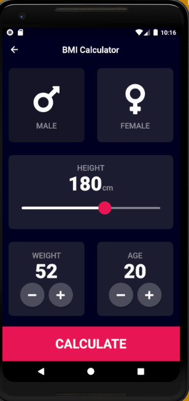
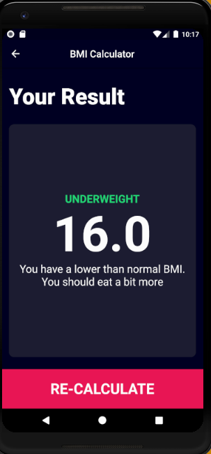

# BMI_Calculator

Made this app using various Flutter and Dart functionalities like : 
  <ol>
    <li>Flutter themes/Making our own Flutter theme</li>
    <li>Custom Flutter Widgets</li>
    <li>Gesture Detector Widget</li>
    <li>Enums, Ternary Operators and Maps in Dart</li>
    <li>Slider widget and SliderTheme class</li>
    </ol>
    

Making use of routes to go from one screen to the next

